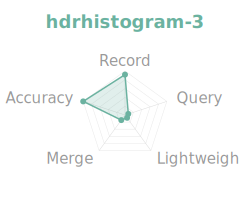

# rust-histogram-benchmark

Benchmark suite for Rust histogram implementations, measuring recording
throughput, percentile query latency, and accuracy across distributions.

## Normalized Radar (outer = better)

      

[Full charts dashboard](results/charts.html) | [Detailed report](results/report.md) | [Highlights](results/highlights.md)

## Implementations

| Crate | Version | Algorithm | Value Type | Repo |
|-------|---------|-----------|------------|------|
| [base2histogram] | 0.2 | Base-2 log-linear + trapezoidal interpolation | `u64` | [drmingdrmer/base2histogram](https://github.com/drmingdrmer/base2histogram) |
| [hdrhistogram] | 7 | Linear sub-buckets within power-of-2 ranges | `u64` | [HdrHistogram/HdrHistogram_rust](https://github.com/HdrHistogram/HdrHistogram_rust) |
| [histogram] (H2) | 1 | Base-2 log-linear | `u64` | [iopsystems/histogram](https://github.com/iopsystems/histogram) |
| [quantogram] | 0.4 | Log-bin histogram with absolute error guarantee | `f64` | [paulchernoch/quantogram](https://github.com/paulchernoch/quantogram) |
| [sketches-ddsketch] | 0.4 | Logarithmic with relative accuracy guarantee | `f64` | [mheffner/rust-sketches-ddsketch](https://github.com/mheffner/rust-sketches-ddsketch) |
| [tdigest] | 0.2 | t-digest merging with centroid compression | `f64` | [MnO2/t-digest](https://github.com/MnO2/t-digest) |

hdrhistogram is benchmarked at two precision levels: `sigfig=2` and `sigfig=3`.

## Feature Matrix

| Feature | base2histogram | hdrhistogram | H2 histogram | quantogram | DDSketch | t-digest |
|---------|:-:|:-:|:-:|:-:|:-:|:-:|
| Native u64 recording | ✓ | ✓ | ✓ | | | |
| Native f64 recording | | | | ✓ | ✓ | ✓ |
| Negative values | | | | ✓ | ✓ | ✓ |
| Percentile point estimate | ✓ | ✓ | | ✓ | ✓ | ✓ |
| Percentile bucket range | | | ✓ | | | |
| Interpolation | Trapezoidal | Linear | None | None | None | Centroid |
| Formal error guarantee | | | | ✓ (abs) | ✓ (α) | |
| Configurable precision | Compile-time | Runtime | Runtime | Runtime | Runtime | Runtime |
| Fixed memory | ✓ | ✓ | ✓ | | | |
| Atomic / concurrent | | | ✓ | | | |
| Sliding window | ✓ | | | | | |
| Merge support | ✓ | ✓ | ✓ | | ✓ | ✓ |
| Serde / serialization | | ✓ | ✓ | | | |
| Sparse representation | | | ✓ | | | |
| Value removal | | | ✓ | | | |
| Inverse query (prank) | | ✓ | | | | |

## Methodology

### Recording Throughput

Measures time per `record(value)` call. Each histogram is pre-created, then
values are recorded in a tight loop. 2M values per workload, 5 warmup
iterations + 20 measured iterations, median reported.

**Workloads:**
- Sequential: values `1..N`
- Random uniform: `u64` drawn from `[1, 10^6]`
- Log-normal: `μ=6, σ=0.5` (typical API latency shape)

Note: t-digest does not support per-value recording. Its benchmark uses
batched `merge_unsorted()` with batch size 1000 and reports amortized
ns per value.

### Percentile Query Latency

Measures time to compute a single percentile after recording 2M values
from the log-normal API distribution. 20K queries per measurement iteration.

### Accuracy

Records 2M samples from known distributions, compares histogram percentile
estimates against exact values computed from the sorted sample.
Relative error = `|exact - estimated| / exact × 100%`.

Note: H2 histogram returns a bucket range, not a point estimate. The
benchmark uses the midpoint `(lo + hi) / 2` for comparison. DDSketch,
quantogram, and t-digest accept `f64`; u64 values are cast via `as f64`.

## Configuration

| Crate | Config | Measured Memory |
|-------|--------|---:|
| base2histogram | `WIDTH=3` (default) | 2.1 KB |
| hdrhistogram | `sigfig=2` (auto-resize) | 8.0 KB |
| hdrhistogram-3 | `sigfig=3` (auto-resize) | 32.0 KB |
| H2 histogram | `grouping_power=2` | 2.0 KB |
| quantogram | default (1% error) | 31.6 KB |
| DDSketch | default config (`α≈0.01`) | 2.0 KB |
| t-digest | `max_size=100` | 1.6 KB |

Memory is measured programmatically using a tracking allocator that
records heap bytes allocated while creating and populating each histogram
with 2M log-normal values.

## Usage

```bash
# Run all benchmarks and generate report
./run.sh

# Run a single histogram benchmark
cargo run --release --bin bench-base2histogram

# Generate report from saved JSON results
cargo run --release --bin report -- results/*.json

# Generate markdown report
cargo run --release --bin report -- --markdown results/*.json
```

## License

MIT
