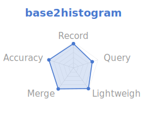
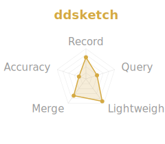
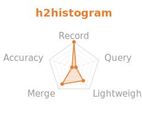
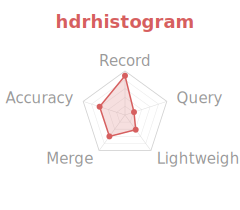
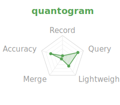
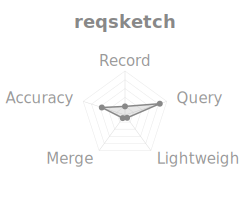
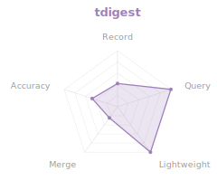

# rust-histogram-benchmark

Benchmark suite for Rust histogram implementations, measuring recording
throughput, percentile query latency, and accuracy across distributions.

## Normalized Radar (outer = better)

      

[Full charts dashboard](results/charts.html) | [Detailed report](results/report.md) | [Highlights](results/highlights.md)

## Implementations

| Crate | Version | Algorithm | Value Type | Repo |
|-------|---------|-----------|------------|------|
| [base2histogram] | 0.2 | Base-2 log-linear + trapezoidal interpolation | `u64` | [drmingdrmer/base2histogram](https://github.com/drmingdrmer/base2histogram) |
| [hdrhistogram] | 7 | Linear sub-buckets within power-of-2 ranges | `u64` | [HdrHistogram/HdrHistogram_rust](https://github.com/HdrHistogram/HdrHistogram_rust) |
| [histogram] (H2) | 1 | Base-2 log-linear | `u64` | [iopsystems/histogram](https://github.com/iopsystems/histogram) |
| [quantogram] | 0.4 | Log-bin histogram with absolute error guarantee | `f64` | [paulchernoch/quantogram](https://github.com/paulchernoch/quantogram) |
| [sketches-ddsketch] | 0.4 | Logarithmic with relative accuracy guarantee | `f64` | [mheffner/rust-sketches-ddsketch](https://github.com/mheffner/rust-sketches-ddsketch) |
| [reqsketch] | 0.1 | Relative-error quantile sketch (REQ) | `f64` | [pmcgleenon/reqsketch-rs](https://github.com/pmcgleenon/reqsketch-rs) |
| [tdigest] | 0.2 | t-digest merging with centroid compression | `f64` | [MnO2/t-digest](https://github.com/MnO2/t-digest) |

Each implementation is benchmarked with one standard balanced configuration,
chosen to keep accuracy, memory, and throughput in a comparable middle ground.

## Feature Matrix

| Feature | base2histogram | hdrhistogram | H2 histogram | quantogram | DDSketch | reqsketch | t-digest |
|---------|:-:|:-:|:-:|:-:|:-:|:-:|:-:|
| Native u64 recording | ✓ | ✓ | ✓ | | | | |
| Native f64 recording | | | | ✓ | ✓ | ✓ | ✓ |
| Negative values | | | | ✓ | ✓ | ✓ | ✓ |
| Percentile point estimate | ✓ | ✓ | | ✓ | ✓ | ✓ | ✓ |
| Percentile bucket range | | | ✓ | | | | |
| Interpolation | Trapezoidal | Linear | None | None | None | None | Centroid |
| Formal error guarantee | | | | ✓ (abs) | ✓ (α) | ✓ (relative rank) | |
| Configurable precision | Compile-time | Runtime | Runtime | Runtime | Runtime | Runtime | Runtime |
| Fixed memory | ✓ | ✓ | ✓ | | | | |
| Atomic / concurrent | | | ✓ | | | | |
| Sliding window | ✓ | | | | | | |
| Merge support | ✓ | ✓ | ✓ | | ✓ | ✓ | ✓ |
| Serde / serialization | | ✓ | ✓ | | | | |
| Sparse representation | | | ✓ | | | | |
| Value removal | | | ✓ | | | | |
| Inverse query (prank) | | ✓ | | | | ✓ | |

## Methodology

### Recording Throughput

Measures time per `record(value)` call. Each histogram is pre-created, then
values are recorded in a tight loop. 2M values per workload, 5 warmup
iterations + 20 measured iterations, median reported.

**Workloads:**
- Sequential: values `1..N`
- Random uniform: `u64` drawn from `[1, 10^6]`
- Log-normal: `μ=6, σ=0.5` (typical API latency shape)

Note: t-digest is benchmarked through a buffered adapter that locally sorts
each batch and feeds `merge_sorted()`. This better reflects the best available
path in the current crate than repeatedly calling `merge_unsorted()`.

### Percentile Query Latency

Measures time to compute a single percentile after recording 2M values
from the log-normal API distribution. 20K queries per measurement iteration.

### Accuracy

Records 2M samples from known distributions, compares histogram percentile
estimates against exact values computed from the sorted sample.
Relative error = `|exact - estimated| / exact × 100%`.

Note: H2 histogram returns a bucket range, not a point estimate. The
benchmark uses the midpoint `(lo + hi) / 2` for comparison. DDSketch,
quantogram, reqsketch, and t-digest accept `f64`; u64 values are cast via `as f64`.

## Configuration

The suite uses the following standard balanced configuration for each crate:

| Crate | Selected config |
|-------|-----------------|
| base2histogram | `width=3` |
| hdrhistogram | `sigfig=2`, fixed bounds |
| H2 histogram | `grouping_power=4`, `max_value_power=64` |
| quantogram | `bins_per_doubling=35`, bounded powers |
| DDSketch | `alpha=0.01`, `max_num_bins=2048`, `min_value=1.0` |
| reqsketch | `k=12`, `rank_accuracy=high` |
| t-digest | `max_size=100`, `batch_size=1000`, `local_sort+merge_sorted` |

Memory is measured as retained heap bytes after recording 2M log-normal
values. This is the live heap footprint of the populated structure, not peak
build-time working memory and not total allocation traffic.

## Usage

```bash
# Run all benchmarks and generate report
./run.sh

# Run a single histogram benchmark
cargo run --release --bin bench-base2histogram

# Generate report from saved JSON results
cargo run --release --bin report -- results/*.json

# Generate markdown report
cargo run --release --bin report -- --markdown results/*.json
```

## License

MIT
